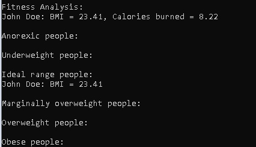

# Fitness-Data-Analyzer
A python implementation of a Fitness Data Analyzer program

## Dependencies
1. Git - https://git-scm.com/downloads
2. Python - https://www.python.org/downloads/

## Installation
1. Choose a folder where to download it
2. Open Git Bash in it
3. Type or copy & paste: git clone https://github.com/iivanov444/Fitness-Data-Analyzer

## Usage
Open Terminal(Windows: PowerShell, Linux: Bash, MacOS: Terminal)
and type or copy & paste: python main_program.py

## Features
BMI calculator, calories burned calculator, grouping by person's physique and a modifiable table of physical activities made out lists of Light-intensity activities (MET<3), Moderate-intensity activities (3<=MET<6) and Vigorous-intensity activities (MET>=6)
MET = Metabolic Equivalent of Task

## Examples
Run the program and it will prompt to add a person's information

Enter fitness data for each person (Enter a blank name to finish):

Enter person's name: John Doe

Enter person's gender (m - male or f - female): m

Enter person's age: 33

Enter person's weight in kilograms: 81

Enter person's height in meters: 1.86

Choose activity number from table of physical activities: 10 (from table: Sexual activity -> MET~5.8)

Enter exercise duration in minutes: 1

Enter person's name:

Fitness Analysis:
John Doe: BMI = 23.41, Calories burned = 8.22

Anorexic people:

Underweight people:

Ideal range people:
John Doe: BMI = 23.41

Marginally overweight people:

Overweight people:

Obese people:

## License
MIT License
